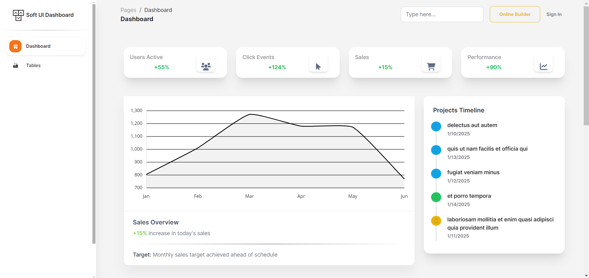

# Soft UI Dashboard React

A modern and fully functional dashboard built with React JS, featuring dynamic charts, CRUD operations, and a beautiful UI design. This project is based on the Creative Tim's Soft UI Dashboard design and enhanced with real-time data integration.



## 🌟 Features

### Dashboard Analytics

- **Real-time Statistics Cards**
  - Active Users Counter
  - Click Events Tracker
  - Sales Performance
  - Overall Performance Metrics

- **Dynamic Charts**
  - Sales Overview Line Chart
  - Monthly Performance Tracking
  - Interactive Data Points
  - Responsive Chart Layouts

### Authors Management

- **Complete CRUD Operations**
  - Create new authors with detailed information
  - Read and display authors in a structured table
  - Update author information through a modal form
  - Delete authors with confirmation

- **Author Details**
  - Profile Image
  - Name and Email
  - Function/Role
  - Organization
  - Employment Status
  - Join Date
 
## 🚀 Technologies Used

- **Frontend Framework**
  - React 18.2.0

- **UI Components**
  - Bootstrap 5
  - Chart.js for data visualization
  - React Router for navigation

- **State Management & API**
  - React Hooks
  - Axios for API calls
  - JSONPlaceholder for mock data

- **Development Tools**
  - ESLint for code quality
  - PropTypes for type checking
  - Git for version control

## 📦 Installation

1. Clone the repository:
   ```bash
   git clone https://github.com/KartikLabhshetwar/Soft-UI-Dashboard-React
   cd Soft-UI-Dashboard-react/frontend
   ```

2. Install dependencies:
   ```bash
   npm install
   ```

3. Start the development server:
   ```bash
   npm run dev
   ```

4. Open your browser and navigate to:
   ```
   http://localhost:5173
   ```

## 🔧 Configuration

### API Integration

The dashboard uses JSONPlaceholder API for demonstration purposes:

- Authors data: https://jsonplaceholder.typicode.com/users
- Posts data: https://jsonplaceholder.typicode.com/posts
- Comments data: https://jsonplaceholder.typicode.com/comments

## 📱 Responsive Design

The dashboard is fully responsive and optimized for:
- Desktop (1200px and above)
- Laptop (992px to 1199px)
- Tablet (768px to 991px)
- Mobile (below 768px)

## 🎯 Usage Examples

### Managing Authors
1. Navigate to the Tables page
2. Click "Add Author" to create a new entry
3. Fill in the required information
4. Use edit/delete buttons for existing authors

### Viewing Analytics
1. Visit the Dashboard page
2. Monitor real-time statistics
3. Interact with the sales chart
4. Check review statistics

## 🤝 Contributing

1. Fork the repository
2. Create your feature branch (`git checkout -b feature/AmazingFeature`)
3. Commit your changes (`git commit -m 'Add some AmazingFeature'`)
4. Push to the branch (`git push origin feature/AmazingFeature`)
5. Open a Pull Request

## 📄 License

This project is licensed under the MIT License - see the [LICENSE](LICENSE) file for details.

## 🙏 Acknowledgments

- [Creative Tim](https://www.creative-tim.com/) for the original Soft UI Dashboard design
- [JSONPlaceholder](https://jsonplaceholder.typicode.com/) for the fake API
- [Chart.js](https://www.chartjs.org/) for the charting library
